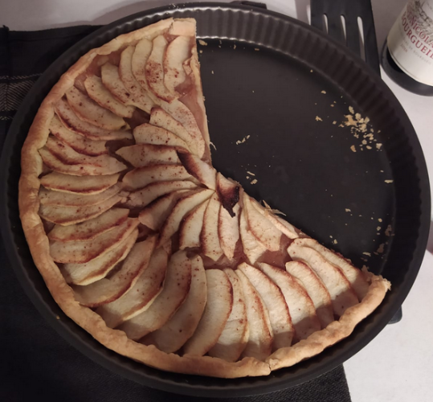

# Tarte aux pommes de Mamie Francette

## Ingrédients :
- 1 pate feuilletée
- Compote de pommes (voir recette)
- 2 ou 3 pommes (Golden de préférence)
- Cannelle
- Sucre de canne ou sucre vanillé.
- Beurre

## Préparation :
1. Etaler la pâte feuilletée dans un moule à tarte préalablement beurré.
2. Piquer le fond de la pâte avec une fourchette.
3. Etaler généreusement la compote.
4. Couper les pommes en quartier d’environ 5 – 7 mm d’épaisseur.
5. Disposer les quartiers sur la compote.
6. Saupoudrer légèrement de sucre de canne et de cannelle.
7. Enfourner à 200°c pendant 25/30 min environ.
